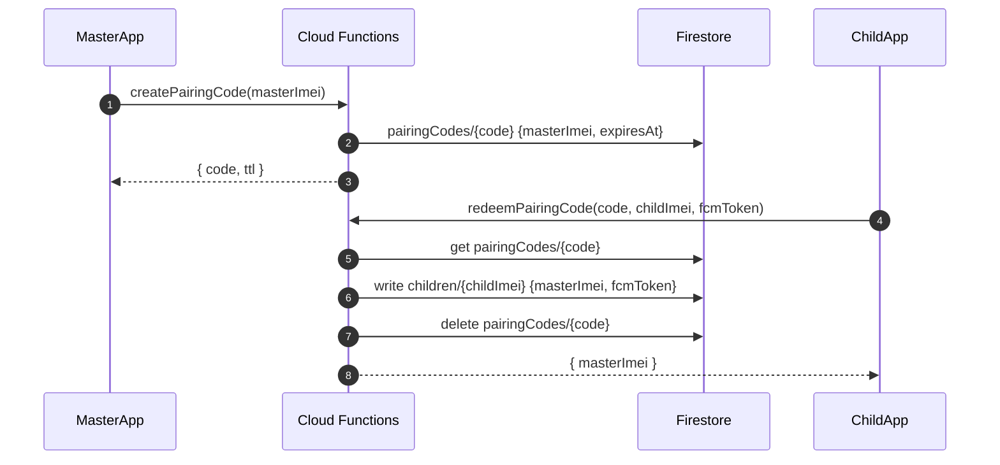
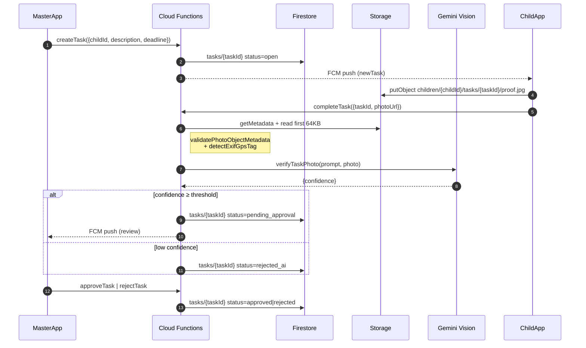
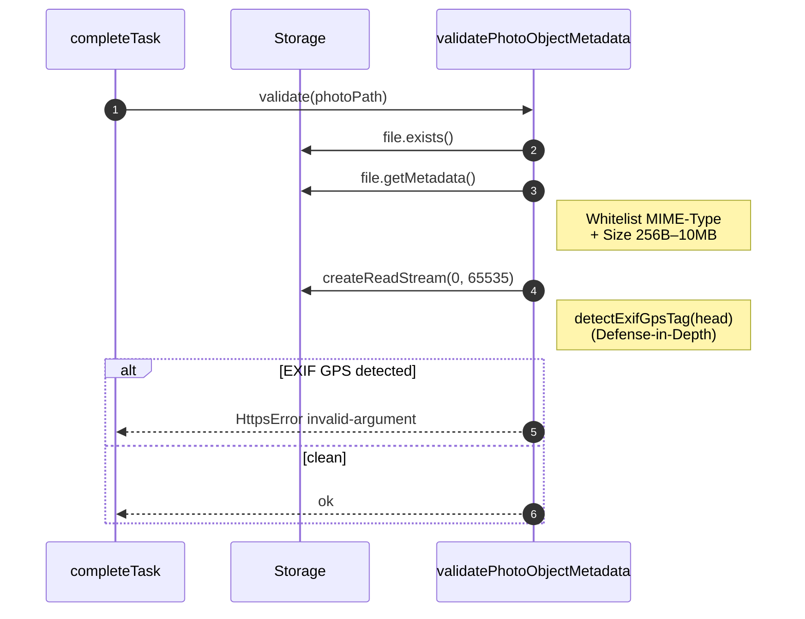
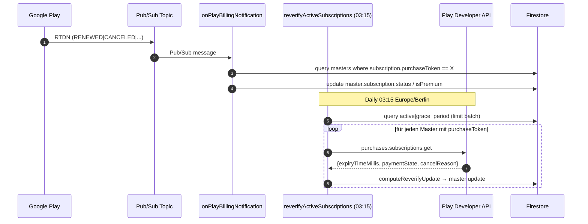
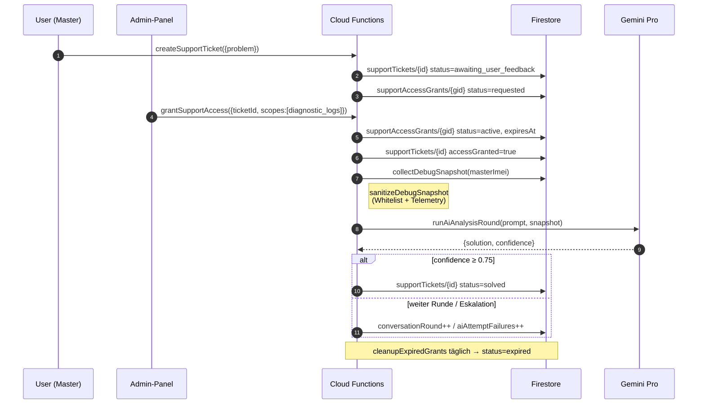
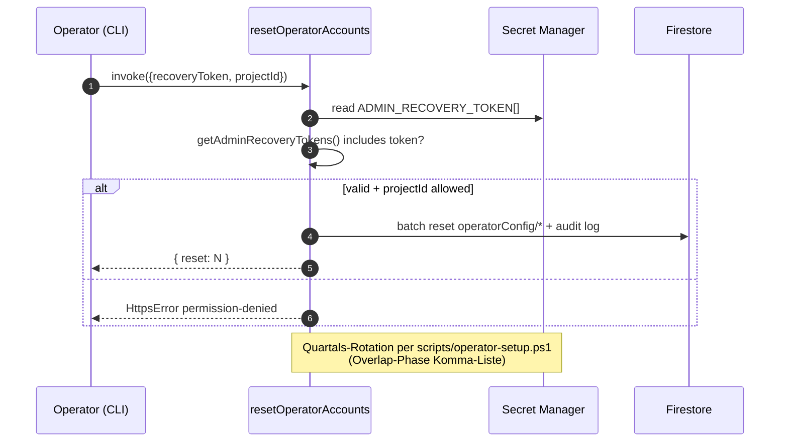
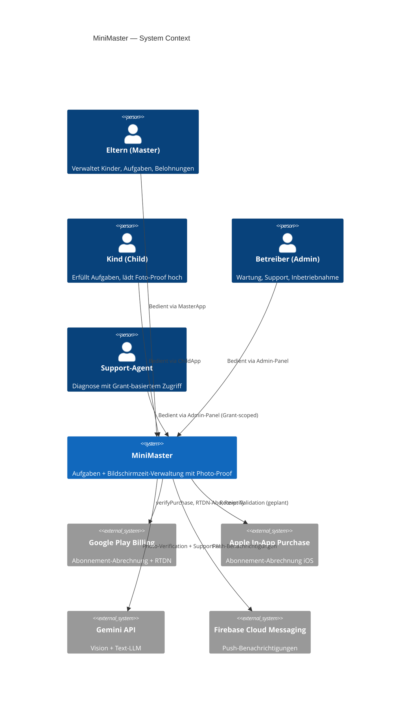
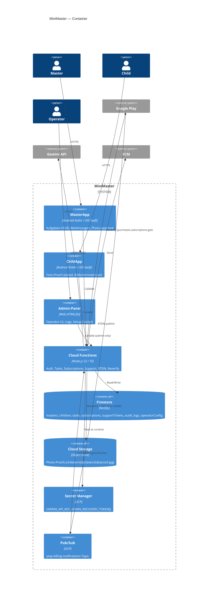
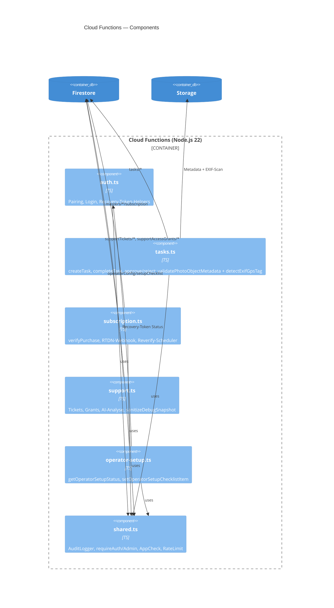

# Architecture Document

> **Status (2026-04):** Formelle C4-Diagramme (Container, Component) und detaillierte UML-Sequenzdiagramme für Pairing, Task-Lifecycle, Photo-Proof, Subscription-Renewal und Support-Grant fehlen noch. Bis zur Erstellung dient die textuelle Variante in Abschnitt 1 als verbindliche Architekturreferenz; Diagramme sind als Backlog-Item geführt (siehe `IMPLEMENTATION_CHECKLIST.md`).

This document outlines the high-level architecture of the Mini-Master application suite.

## 1. High-Level Diagram (C4 - Context)

Bis ein formales C4-Diagramm gepflegt ist, gilt folgender textueller Kontext als verbindlich:

- **Eltern** -> `masterApp` (Android, Kotlin/Compose) bzw. `iosMasterApp` (Swift, Family Controls — Beta)
- **Kinder** -> `childApp` (Android, Accessibility Service) bzw. `iosChildApp` (Swift, Screen Time API — Beta)
- **Betreiber / Support** -> `admin-panel` (PWA, Firebase Auth + App Check) bzw. `desktop` (Electron-Wrapper)
- `masterApp` / `childApp` / `admin-panel` <-> **Firebase Backend** (Auth, Firestore, Storage, Cloud Functions, FCM/APNs, App Check)
- **Firebase Backend** <-> **Google Play Billing API** (Subscription-Verifikation)
- **Firebase Backend** <-> **Apple App Store Server API** (geplant, derzeit Stub)
- **Firebase Backend** <-> **AI-Provider** (Gemini/OpenAI über `src/ai-config.ts`, opt-in pro Operator)

> Hinweis: `parent-panel/` und `child-panel/` sind schlanke Single-Page-Web-Panels für **Support-Ticketing und Debug-Consent**. Beide nutzen Firebase Auth (Custom Token via `generateCustomToken`), App Check und rufen `createSupportTicket`, `grantDebugAccess`/`skipDebugMode` sowie `processUserReplyMessage` auf. Sie ersetzen keine native App-Funktionalität, sondern stellen einen browserbasierten Notfall- und Support-Kanal bereit.

## 2. Component Breakdown (Current State vs Intended)

### 2.1. `masterApp` (Parent App)

- **Purpose:** Allows parents to manage devices, set rules, create tasks, and review proofs.
- **Tech:** Kotlin, Jetpack Compose, Hilt, WorkManager, Google Play Billing Library.
- **Key Screens:** Registration, Dashboard, Create Task, Review Task, Subscription.

### 2.2. `childApp` (Child App)

- **Purpose:** Receives rule state (lock flag, app blacklist structure, usage rules object), displays tasks, uploads photo proof, heartbeat ping.
- **Tech:** Kotlin / Jetpack Compose / Hilt.
- **Key Components (implemented):**
  - `RuleSyncService` (FCM-triggered sync)
  - `HeartbeatWorker` (lastSeen updates)
  - `MiniMasterAccessibilityService` (foreground monitoring, app blocking, usage limits)
  - `BlockingOverlayService` (overlay-based app blocking)
- **Remaining gaps:** Robust offline policy cache with conflict resolution, stronger anti-tamper hardening, and broader device-level E2E validation.

### 2.3. Firebase Backend

- **Cloud Functions (TypeScript):** Core business logic. Key functions include pairing, task lifecycle, subscription verification.
- **Firestore:** Flat schema (see section 4). Security rules rely on auth presence; fine-grained auth enforced in functions.
- **Firebase Storage:** Photo proof storage.
- **Firebase Cloud Messaging (FCM):** Diff-based child device updates.

## 3. Key Architectural Decisions & Patterns

- **Server-Authoritative Logic:** All mutations gated by callable functions (argument validation + secretKey checks). Clients remain thin.
- **FCM Diff Strategy:** `onChildDeviceUpdateV2` computes *minimal* changed fields (lock, blacklist, usage rules) → reduces payload & avoids redundant updates.
- **Bidirectional Control-Plane (new):** `src/device-sync.ts` introduces a platform-agnostic command/ack channel: state changes are written as versioned `commands` documents in Firestore; FCM/APNs push serves only as a wake-up hint. Devices pull authoritative commands via `fetchPendingCommands` and confirm application via `acknowledgeCommand`. This pattern guarantees delivery even during extended offline periods and works identically for Android and iOS.
- **Policy Versioning:** A monotonically increasing `policyVersion` counter (transaction-guaranteed) on `children/{childId}` is carried in every command and FCM data payload. Devices track `lastPolicyVersion` to detect missed updates and trigger `syncPolicySnapshot` on reconnect.
- **Flat Firestore Schema (Interim):** Active collections: `masters`, `children`, nested `children/{id}/tasks`, `pairingCodes`, `pairingTokens`, `children/{id}/commands`, `children/{id}/events`. Legacy/in-progress hierarchical `families/*` path intentionally disabled in `firestore.rules`.
- **Strict Expiry Semantics:** Pairing tokens (5 min) vs 6-digit codes (24 h); commands expire after 48 h; expired or malformed docs deleted proactively.
- **MVVM + Hilt:** ViewModels isolate UI; injection used but not security-critical.

## 4. Data Model (Firestore – Current vs Planned)

### Current (Implemented)

Current top-level paths:

- `masters/{imei}`
- `children/{childImei}`
- `children/{childImei}/tasks/{taskId}`
- `pairingTokens/{uuid}`
- `pairingCodes/{6digit}`

Child document fields (selected): `masterImei`, `isLocked`, `appBlacklist` (array), `usageRules` (object), `fcmToken`, `lastSeen`, `platform` (`android`|`ios`), `capabilities` (string[]), `pushEndpoints` (array), `policyVersion` (number), `lastPolicyVersion` (number).

**Control-Plane Subcollections (New)**:

- `children/{childId}/commands/{commandId}` — Master→Child versioned commands (`lock_state`, `app_blacklist`, …)
- `children/{childId}/events/{eventId}` — Child→Master events (`usage_report`, `tamper_event`, `heartbeat`, …)

### Planned (Not Implemented Yet)

Planned target shape:

- `families/{familyId}`
- `families/{familyId}/children/{childId}`
- `families/{familyId}/tasks/{taskId}`

Blocked until: migration design (dual-write + backfill), updated rules, updated queries, test refactor.

## 5. Migration Considerations (Flat → Hierarchical Families)

|Aspect|Current|Future Target|Migration Notes|
|------|-------|-------------|---------------|
|Ownership Linking|child.masterImei|familyId + relation doc|Introduce mapping layer first|
|Security Rules|Auth-only + function-level auth|Role-based + claim checks|Requires new auth model (claims)|
|Queries|Direct collection scans|Scoped under family|Add composite indexes post-move|
|Triggers|on children/{childId}|families/{fid}/children/{childId}|Maintain both during transition|
|Code Paths|Direct `children` reads|Resolver by family context|Provide adapter util|

Phased approach recommended: (1) Introduce families collection w/ deny rules lifted only for read via Cloud Functions. (2) Dual-write. (3) Backfill. (4) Switch reads. (5) Remove flat collections.

## 5.2. Legacy `secretKey` Auth — Migrationsplan (Cutover)

Bis Frühjahr 2026 nutzten Web-Clients (`web-control`, `parent-panel`, `child-panel`) und Teile der iOS-Apps einen serverseitig vergebenen `secretKey` als Sitzungsmerkmal. Der Cutover auf den serverauthentifizierten Bootstrap-Token-Flow (`createMasterWebBootstrapToken` + Firebase-ID-Token) erfolgt in drei Stufen, koordiniert durch `getLegacyAuthUsageStats` und `legacyAuthCutoverMonitor`.

|Stufe|Status|Maßnahme|Akzeptanzkriterium|
|-----|------|--------|------------------|
|**1 — Inventur & Freeze**|✅ erledigt|Vollständige Liste aller `secretKey`-Aufrufer (Backend + Clients) im Inventar; keine neuen Aufrufer dürfen ergänzt werden (Lint-Regel + Code-Review-Gate). iOS-`AuthService` bereits auf Bootstrap-Vertrag umgestellt.|`getLegacyAuthUsageStats` zeigt stabile Aufrufer-Liste, keine neuen UID-Quellen über 30 Tage.|
|**2 — Web-Client-Cutover**|🔄 in Arbeit|Web-Clients (`web-control`, `parent-panel`, `child-panel`) nutzen ausschließlich Bootstrap-Token + Firebase-Auth. `secretKey`-Login-Pfade werden durch Feature-Flag `legacyAuthEnabled=false` deaktiviert; Fallback nur via Operator-Override (Audit-geloggt).|`legacyAuthCutoverMonitor` meldet < 1 % Restnutzung pro 24 h über zwei Wochen.|
|**3 — Hard-Cut & Cleanup**|🔒 wartend|Nach 14-Tage-Monitor mit 0 % Web-Restnutzung: Backend lehnt `secretKey`-basierte Aufrufe mit `unauthenticated` ab. `secretKey`-Felder im Firestore-Schema bleiben für Audit/DSAR 90 Tage lesbar, dann durch TTL-Sweep entfernt. Code-Pfade und Tests werden in einem dedizierten Cleanup-PR gelöscht.|`getLegacyAuthUsageStats.totalUsage = 0` über 14 Tage; alle `secretKey`-Code-Pfade entfernt; Firestore-Rules verbieten Schreiben auf `secretKey`.|

**Rollback-Pfad pro Stufe:** Feature-Flag `legacyAuthEnabled` in `operatorConfig/runtime` schaltet Stufe 2 bei Inzident wieder aktiv (max. 24 h Window, danach Cutover-Plan neu starten). Stufe 3 ist nicht reversibel ohne erneuten Migrations-Sprint.

**Beobachtbarkeit:** `getOperatorSetupStatus` aggregiert die Cutover-Telemetrie (Stage, last24hCallCount, lastCallerSample) und stellt sie im Admin-Panel dar.

## Compliance and retention status

- Legal policy publishing and re-consent enforcement run on dedicated Cloud Functions with Firestore-backed `legalPolicies` and `masterLegalConsents` collections.
- DSAR export and account deletion must cover compliance side-data in addition to the core profile domain, especially `masterLegalConsents`, `supportTickets`, `supportAccessGrants`, and user-scoped observability collections.
- Audit and error logs are prepared for Firestore TTL rollout via per-document `ttl` timestamps; `performance_metrics` remains the next observability collection to align.

## 5.1. Backend Module Overview

The Cloud Functions backend is split into domain modules under `src/`:

|Module|File|Purpose|Key Exports|
|------|----|-------|-----------|
|**Auth**|`src/auth.ts`|Registration, token generation, operator key management, account reset|`registerMasterDevice`, `generateCustomToken`, `createOperatorAccessKey`, `redeemOperatorAccessKey`, `resetOperatorAccounts`, `resetAllAuthUsers`|
|**Pairing**|`src/pairing.ts`|Master-child pairing via codes and tokens|`createPairingCode`, `validatePairingCode`, `generatePairingLink`, `validatePairingToken`|
|**Rules**|`src/rules.ts`|Device lock, app blacklist, usage rules, heartbeat, FCM registration|`setDeviceLocked`, `updateAppBlacklist`, `setUsageRules`, `getRulesForChild`, `recordHeartbeat`, `registerFcmToken`|
|**Tasks**|`src/tasks.ts`|Task CRUD and photo proof lifecycle|`createTask`, `completeTask`, `approveTask`, `rejectTask`|
|**Subscription**|`src/subscription.ts`|Play Store purchase verification, subscription status, scheduled expiry|`verifyPurchase`, `getSubscriptionStatus`, `revokeSubscription`, `checkExpiredSubscriptions`|
|**Support**|`src/support.ts`|AI-assisted tickets, debug access, email follow-up, scheduled grant cleanup|`createSupportTicket`, `grantDebugAccess`, `skipDebugMode`, `processUserReplyMessage`, `analyzeWithDebugData`, `getDebugInfo`, `onTicketCreated`, `onSupportTicketUpdated`|
|**Legal**|`src/legal.ts`|GDPR consent, legal policy publishing, re-consent enforcement|`getActiveLegalPolicies`, `needsLegalReconsent`, `recordLegalConsent`, `publishLegalPolicy`, `markLegalReconsentRequired`|
|**Admin**|`src/admin.ts`|Health check, error analysis, auto-fix, knowledge base, FCM testing|`adminHealthCheck`, `analyzeSystemErrors`, `executeAutoFix`, `getKnowledgeBase`, `updateKnowledgeBase`, `sendTestFcmMessage`|
|**Triggers**|`src/triggers.ts`|Firestore-triggered FCM diff push, task photo analysis|`onChildDeviceUpdateV2`, `analyzeTaskPhoto`, `onTaskStatusChange`|
|**Device Sync**|`src/device-sync.ts`|Bidirectional Control-Plane for Android & iOS; versioned commands, device events, policy snapshots|`registerDeviceEndpoint`, `publishDeviceEvent`, `fetchPendingCommands`, `acknowledgeCommand`, `syncPolicySnapshot`|
|**Shared**|`src/shared.ts`|`requireAdmin()`, `AuditLogger`, role types|Internal utilities used by all modules|
|**Entrypoint**|`index.ts`|Re-exports all callable functions + triggers|—|
|**Init**|`firebase.ts`|Singleton Firebase Admin SDK (lazy getters: `db()`, `auth()`, `storage()`)|`db`, `auth`, `storage`|

## 6. Gaps & Future Work

- Hardening of enforcement engine (OEM-specific behavior, bypass resistance, battery optimization handling)
- Subscription renewal / entitlement revocation scheduler
- Photo proof validation (size/content)
- Structured auth (token claims replacing raw secret keys)
- Metrics & audit logging pipeline (beyond functions.logger)

## 7. Sequence (Conceptual) – Pairing (Current)

1. Master: `registerMasterDevice` → receives `secretKey`.
2. Master: `generatePairingLink` (5m token) OR `createPairingCode` (6-digit / 24h).
3. Child: submits token/code + its IMEI (`validatePairingToken` / `validatePairingCode`).
4. Backend: creates child doc, deletes ephemeral token/code, returns linkage confirmation.
5. Subsequent state changes (lock, blacklist, usageRules) propagate via trigger → FCM diff payload.

---
*This document reflects current prototype boundaries. Update when migration or enforcement engine designs are approved.*

## Sequenzdiagramme

### Pairing (Master ↔ Child)

### Task Lifecycle (Erstellung → Foto-Proof → AI-Verifikation → Approval)

### Photo-Proof Validation Detail

### Subscription Renewal (RTDN + Periodic Reverify)

### Support Grant (Ticket → Debug-Snapshot → AI-Lösung)

### Admin Recovery / Reset Operator Accounts

## C4-Diagramme

### Level 1 — System Context

### Level 2 — Container

### Level 3 — Component (Cloud Functions)

