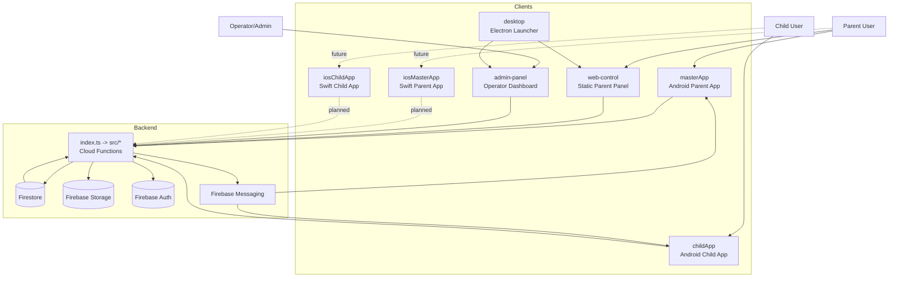

# Repository Architecture Map 2026-04-05

## Überblick

MiniMaster besteht aus einem Firebase-Backend, zwei Android-Apps, zwei Web-Panels, einem Electron-Launcher sowie einem beginnenden iOS-Zweig.

## Komponentenkarte

## Verantwortlichkeiten nach Bereich

### Backend

- [index.ts](../index.ts): Barrel-Export aller Cloud Functions
- [firebase.ts](../firebase.ts): zentrale Firebase-Admin-Initialisierung
- [src/shared.ts](../src/shared.ts): Auth-Helfer, Audit-Logging, Rate-Limits, App Check
- [src/auth.ts](../src/auth.ts): Rollen, Bootstrap, Token, Recovery- und Reset-Pfade
- [src/pairing.ts](../src/pairing.ts): Pairing-Codes, Pairing-Links, Trial-Aktivierung
- [src/device.ts](../src/device.ts): Locking, Blacklists, Usage-Rules, Heartbeat, FCM-Token
- [src/device-sync.ts](../src/device-sync.ts): bidirektionaler Command-/Event-Kanal
- [src/tasks.ts](../src/tasks.ts): Task-State-Machine und Proof-Handling
- [src/support.ts](../src/support.ts): Tickets, Debug-Consent, AI-gestützte Hilfslogik
- [src/legal.ts](../src/legal.ts): Policies, Consent und Reconsent
- [src/subscription.ts](../src/subscription.ts): Abo-Status und Kaufprüfung
- [src/admin.ts](../src/admin.ts): DSAR, Health, Knowledge Base, AI-Error-Analyse, Operator-Aktionen
- [src/triggers.ts](../src/triggers.ts): Firestore-Trigger, FCM-Diff-Push, Bildanalyse

### Datenhaltung

- [firestore.rules](../firestore.rules): Zugriffsschutz für Firestore
- [storage.rules](../storage.rules): Zugriffsschutz für Task- und Foto-Uploads
- Flaches Modell mit Collections wie `masters`, `children`, `supportTickets`, `supportAccessGrants`, `subscriptions`

### Android

- [masterApp](../masterApp): Eltern-App mit Billing, Task-Review, Regelverwaltung
- [childApp](../childApp): Kinder-App mit Rule Sync, Accessibility-Service, Heartbeat, Debug-Broadcasts

### Web / Desktop

- [web-control](../web-control): Eltern-Steuerpanel
- [admin-panel](../admin-panel): Operator- und Support-Panel
- [desktop](../desktop): Electron-Container für beide Panels

### iOS

- [iosMasterApp](../iosMasterApp), [iosChildApp](../iosChildApp), [iosSharedServices](../iosSharedServices)
- Architektur vorhanden, operative Reife deutlich unter Android

## Zentrale Datenflüsse

### Pairing

1. Parent-App oder Web-Panel ruft Pairing-Funktion auf.
2. Backend erzeugt Code oder Link in Firestore.
3. Child-App validiert Code oder Token.
4. Backend verknüpft Child und Master in `children/{childId}`.

### Regelverteilung

1. Parent ändert Sperr- oder Nutzungsregeln.
2. Backend schreibt die neue Policy in Firestore.
3. [src/triggers.ts](../src/triggers.ts) erzeugt Commands in [src/device-sync.ts](../src/device-sync.ts).
4. FCM dient als Wake-up-Hinweis, Firestore bleibt kanonische Quelle.

### Task-Flow

1. Parent erstellt Task.
2. Child sendet Foto-Proof.
3. Backend setzt Status auf `pending_approval`.
4. Parent genehmigt oder lehnt ab.
5. Trigger benachrichtigt Parent oder Child.

### Support- und Debug-Flow

1. Nutzer erstellt Support-Ticket.
2. Backend fordert Debug-Consent an.
3. Nutzer erteilt optional Debug-Zugriff.
4. Support- und AI-Logik arbeitet mit Ticket- und Snapshot-Daten.

## Architekturhotspots

- [src/auth.ts](../src/auth.ts): privilegierte Operator- und Recovery-Funktionen
- [src/device-sync.ts](../src/device-sync.ts): plattformübergreifender Kontrollkanal
- [src/support.ts](../src/support.ts): komplexe Zustands- und Zugriffslogik
- [firestore.rules](../firestore.rules): tragende Mandanten- und Ownership-Schicht
